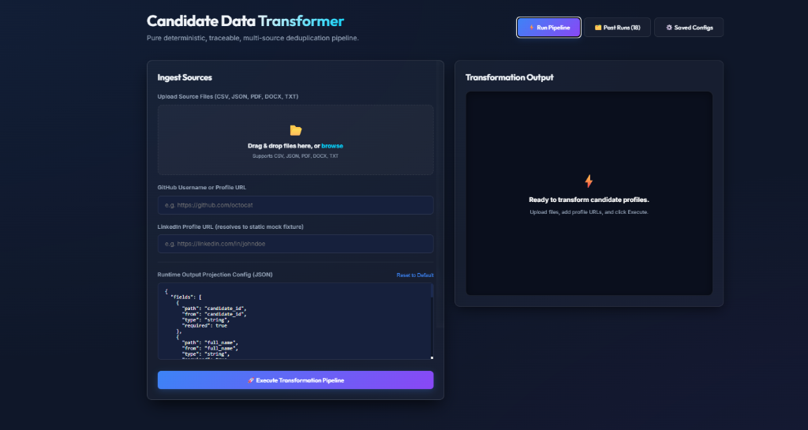
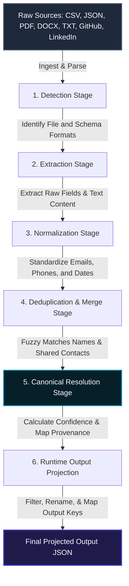

# Multi-Source Candidate Data Transformer

A modern, high-performance, single-monorepo full-stack application designed to ingest candidate profiles from multiple structured and unstructured sources (CSV, JSON, PDF, DOCX, TXT), deduplicate them into a single canonical record with complete field-level provenance, and project them into custom output shapes using a runtime configuration JSON schema.

---

## 📸 Dashboard Preview



---

## 🔄 Pipeline Workflow & Architecture

The deduplication engine operates as a pure deterministic pipeline. Each step executes in sequence, ensuring complete predictability and traceability from raw file ingestion to custom schema projection:



### Technical Detail Breakdown:
1. **Detection Stage**: Identifies source document types and schemas (e.g. ATS layout vs. Recruiter CSV spreadsheet format) based on file headers, extensions, and content patterns.
2. **Extraction Stage**: Parses files (utilizing `pdf-parse` for PDFs, `mammoth` for Word documents, and `papaparse` for CSVs) to fetch raw properties.
3. **Normalization Stage**: Standardizes contact identifiers (Day.js for dates, E.164 phone formats using `libphonenumber-js`, and lowercase emails).
4. **Deduplication & Merge Stage**: Identifies candidate identity overlaps using fuzzy name matching (`fuse.js`) combined with shared normalized email/phone contacts.
5. **Canonical Resolution Stage**: Resolves field discrepancies according to a strict source-priority hierarchy, registers confidence percentages, and saves a field-level **Provenance Map** (merging history).
6. **Runtime Output Projection**: Applies a Zod-validated JSON schema to map, rename, or omit properties on the fly.

---

## 💻 Frontend UI/UX Design

The frontend is a single-page React client built on Vite, adhering to a sleek dark-glass design language:
- **Responsiveness**: Fits viewports from mobile (320px+) up to large desktops (1920px+). Side-by-side dashboard shifts into a single-column layout on smaller viewports.
- **Micro-interactions**: Subtle bouncing icons on uploader drag-and-drop actions, glowing borders on card selections, and smooth expand/collapse animations for raw JSON and merging logs.
- **Standby Visualizer**: Features a CSS-animated rendering of document files streaming into a central deduplicator core while in standby.
- **Skeleton Loading Panels**: Pulsating shimmers that outline incoming candidate card structures during server extraction, providing a highly visual progress indicator.

---

## 🛠️ Monorepo Structure

```bash
├── client/           # React + Vite frontend application
│   ├── src/
│   │   ├── App.jsx   # Main React component (fully responsive)
│   │   ├── index.css # HSL design tokens, glows, timelines, and skeletons
│   │   └── main.jsx  # Client bootstrap
│   └── package.json
├── server/           # Express backend server (REST API)
│   ├── src/
│   │   ├── server.js # API Router, health checks, and database configuration
│   │   ├── pipeline/ # Deduplication pipeline core modules
│   │   └── db/       # MongoDB schemas and models (OutputConfig, PipelineRun)
│   └── package.json
└── package.json      # Monorepo scripts (Dev concurrency, installations)
```

---

## 🚀 Setup & Run Instructions

### Prerequisites
- [Node.js](https://nodejs.org/) (v18 or higher)
- [MongoDB](https://www.mongodb.com/) (running locally on port 27017, or a custom URI via `.env`)

### 1. Installation
Install server and client dependencies with a single command from the monorepo root:
```bash
npm run install:all
```

### 2. Configure Environment (Server)
From the server directory, copy the template `.env`:
```bash
cd server
cp .env.example .env
```

### 3. Launch Development Mode
Run both the backend Express router and the React Vite client concurrently from the root directory:
```bash
npm run dev
```
- **Frontend Dashboard**: [http://localhost:3000](http://localhost:3000) (proxied requests go to port 5000)
- **Backend API**: [http://localhost:5000](http://localhost:5000)

---

## 🛠️ CLI Surface

Run the deduplication pipeline directly on local directories or files via the CLI:
```bash
# Run on sample files using default configurations
npm run cli -- run --sources ../samples/recruiter_sample.csv,../samples/ats_sample.json --out ./output.json

# Run on sample files with a custom projection config
npm run cli -- run --sources ../samples/recruiter_sample.csv,../samples/ats_sample.json --config ../config.example.json --out ./output_projected.json

# Run without database writes (offline mode)
npm run cli -- run --sources ../samples --out ./output.json --no-persist
```

---

## 🧪 Testing

Execute automated unit and integration tests using Vitest:
```bash
cd server
npm run test
```
